# Bluetooth Smart Car with Obstacle Avoidance Capabilities - Public Overview

Public technical overview of an Arduino/C++ smart-car prototype controlled over Bluetooth with a PlayStation 5 controller. The project combines manual driving, analog acceleration, steering control, headlights, safety behavior, and an autonomous obstacle-avoidance mode based on an HC-SR04 ultrasonic sensor.

<p align="center">
  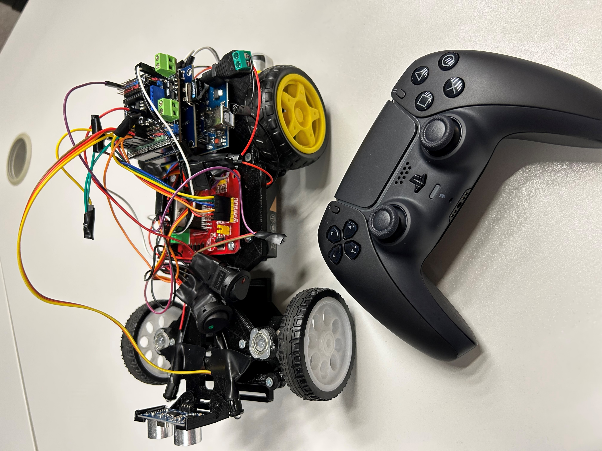
</p>

> The full source code is private due to intellectual property considerations. This repository documents the project’s functionality, architecture, technologies, hardware setup, demo media, and implementation approach without exposing private source code, generated files, or internal Git history.

---

## Demo Videos

### Manual Bluetooth Control

https://github.com/user-attachments/assets/1adfdc49-4890-4309-a1f3-69dc6789783e

### Obstacle Avoidance Mode

https://github.com/user-attachments/assets/57011fe0-489b-4c29-a6c8-5f0f7d069c5e

---

## Project Summary

This project presents a Bluetooth-controlled smart car built around an Arduino Uno and the ATmega328P microcontroller.

The car supports two main operating modes:

1. **Manual Bluetooth control** using a PlayStation 5 controller.
2. **Autonomous obstacle avoidance** using an ultrasonic distance sensor and rule-based movement logic.

The system combines embedded C++ programming, Bluetooth HID communication, PWM-based motor control, servo steering, ultrasonic sensing, LED output, safety behavior, and a 3D-printed mechanical chassis into one functional prototype.

---

## Main Capabilities

### Manual Bluetooth Driving

The car is controlled with a PlayStation 5 controller connected over Bluetooth through a USB Bluetooth receiver and USB Host Shield.

Manual mode includes:

- forward movement;
- reverse movement;
- analog acceleration using trigger pressure;
- left/right steering using the left stick;
- headlights toggle using the controller;
- autonomous mode activation and deactivation;
- controller connect/disconnect behavior;
- safety behavior when no movement command is active.

### Autonomous Obstacle Avoidance

The autonomous mode uses an HC-SR04 ultrasonic sensor to detect objects in front of the car. When an obstacle is detected, the car performs a rule-based repositioning sequence to avoid direct contact.

<p align="center">
  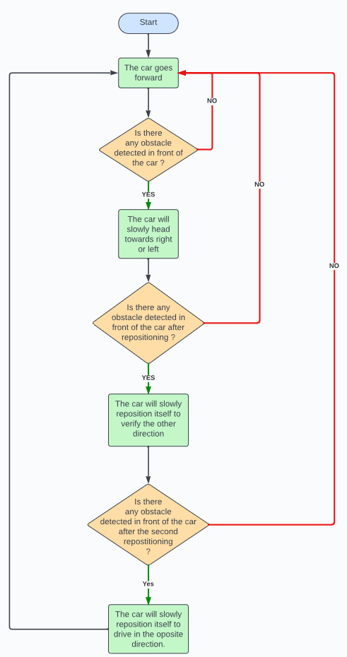
</p>

The obstacle-avoidance flow is:

1. Move forward.
2. Measure the distance to the object ahead.
3. If an obstacle is detected, reposition toward one side.
4. Check the new direction.
5. If another obstacle is detected, reposition in the opposite direction.
6. If both directions are blocked, turn around.

<p align="center">
  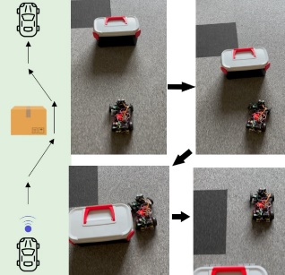
</p>

### Safety Behavior

The implementation includes several safety-oriented behaviors:

- the car remains stationary when no movement command is received;
- the steering servo returns to a straight position when no steering input is active;
- controller disconnection can stop the car;
- an emergency-stop style behavior halts control commands;
- autonomous mode can be activated and deactivated from the controller.

---

## System Overview

```text
PlayStation 5 Controller
  ↓
Bluetooth connection
  ↓
USB Bluetooth Receiver
  ↓
USB Host Shield
  ↓
Arduino Uno / ATmega328P
  ↓
Motor, steering, lights, and obstacle-avoidance control
```

The Arduino continuously reads controller input and converts it into movement, steering, lighting, or mode commands. When autonomous mode is enabled, the ultrasonic sensor becomes the main input for navigation decisions.

---

## Technologies Used

### Programming & Embedded Control

- C++
- Arduino IDE
- Arduino Uno
- ATmega328P microcontroller
- PWM motor control
- PWM servo control
- timer-based control logic
- USB Host Shield communication
- Bluetooth HID controller input

### Hardware Components

- Arduino Uno development board
- PlayStation 5 controller
- USB Host Shield
- USB Bluetooth receiver
- Gravity IO Expansion Shield
- L298N dual H-bridge motor driver
- 2x DC motors, 3–6V
- MG90S servo motor
- HC-SR04 ultrasonic sensor
- 2x LEDs used as headlights
- 3x switches
- 3x battery holders
- 3D-printed chassis
- screws, nuts, bolts, bearings, and 3D-printed spacers

---

## Component Gallery

<table>
  <tr>
    <td align="center">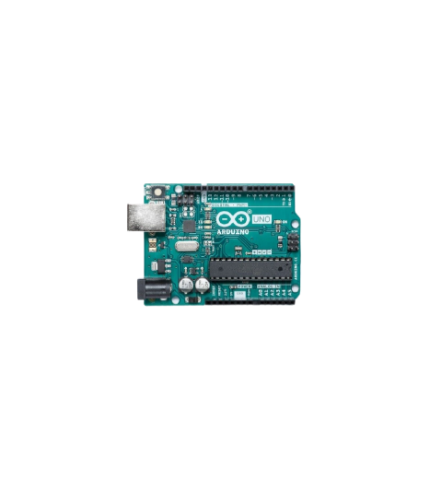<br/>Arduino Uno</td>
    <td align="center"><br/>PS5 Controller</td>
    <td align="center">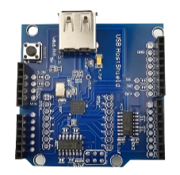<br/>USB Host Shield</td>
    <td align="center">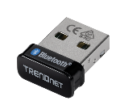<br/>Bluetooth Receiver</td>
  </tr>
  <tr>
    <td align="center">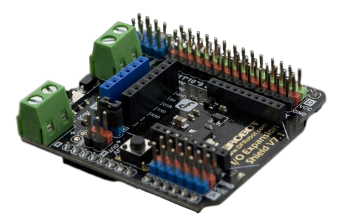<br/>Gravity IO Shield</td>
    <td align="center">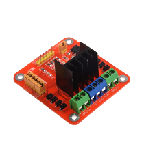<br/>L298N Motor Driver</td>
    <td align="center">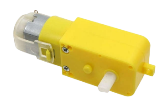<br/>DC Motor</td>
    <td align="center">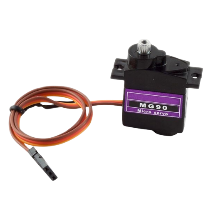<br/>MG90S Servo</td>
  </tr>
  <tr>
    <td align="center" colspan="4">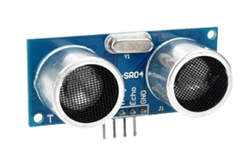<br/>HC-SR04 Ultrasonic Sensor</td>
  </tr>
</table>

---

## 3D-Printed Chassis and Assembly

The chassis was 3D-printed and designed to hold the Arduino board, shields, motor driver, battery holders, steering system, ultrasonic sensor, and supporting mechanical parts. The layout was chosen to keep wiring accessible and make component replacement easier.

<p align="center">
  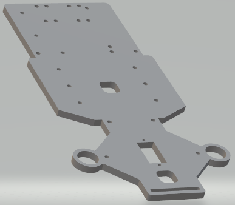
</p>

Additional printed parts were used for the steering system and structural mounting points.

<p align="center">
  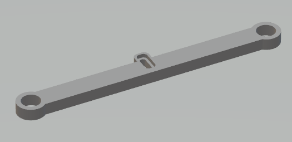
  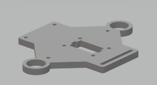
</p>

The Arduino Uno is mounted on the chassis, with the USB Host Shield and Gravity IO Expansion Shield stacked above it. The front section contains the steering system and the ultrasonic sensor.

<p align="center">
  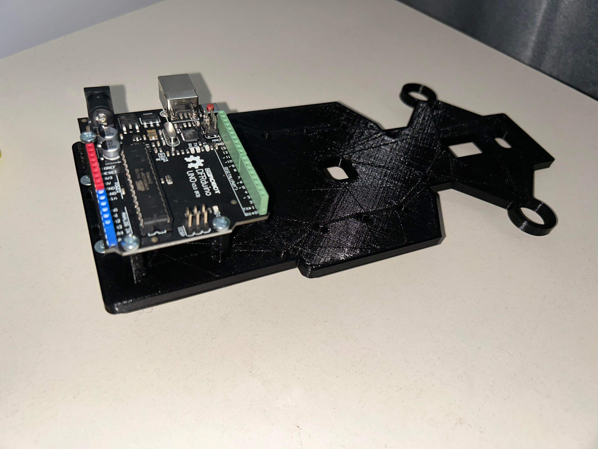
  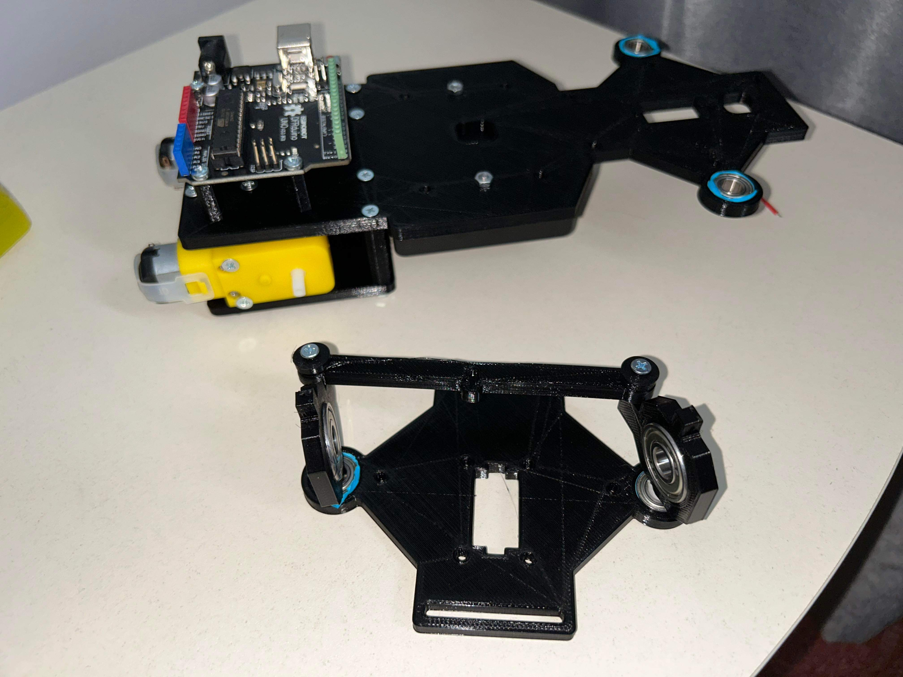
</p>

---

## Controller Mapping

| Controller input | Function |
|---|---|
| PS Button | Connect / disconnect controller |
| Right Trigger | Move forward |
| Left Trigger | Move backward |
| Left Stick X-axis | Steering left / right |
| UP Button | Headlights ON / OFF |
| Triangle Button | Auto mode ON |
| Circle Button | Auto mode OFF |

This mapping creates a natural driving experience by combining analog trigger acceleration with stick-based steering.

---

## Software Architecture

The code follows a modular embedded structure. Each main hardware area has dedicated logic, making the project easier to understand, debug, and extend.

```text
Controller input handling
  ↓
Bluetooth communication through USB Host Shield
  ↓
Manual driving command interpretation
  ↓
Motor control through L298N
  ↓
Servo steering control
  ↓
LED headlight control
  ↓
Obstacle avoidance mode when enabled
```

### Motor Control

The L298N motor driver receives direction and speed commands from the Arduino. PWM is used to control motor speed, allowing smoother movement than simple on/off control.

### Servo Steering

The MG90S servo motor handles steering. The steering logic includes a neutral reset behavior that brings the wheels back to a straight position when no steering input is received.

### Ultrasonic Distance Measurement

The ultrasonic sensor measures distance using trigger and echo pins. The measured pulse time is converted into distance using:

```text
Distance = (Time of Impulse × 0.034) / 2
```

The `0.034` factor approximates the speed of sound in centimeters per microsecond. The division by two accounts for the signal traveling to the object and returning to the sensor.

### Bluetooth Communication

The USB Bluetooth receiver pairs with the PS5 controller through the USB Host Shield. Once connected, the Arduino reads controller inputs continuously and converts them into movement, steering, lighting, or mode commands.

### LED Headlight Control

The two LEDs act as headlights and are controlled from the PS5 controller. They are part of the manual driving interface rather than a separate system, making the car feel closer to a real vehicle prototype.

---

## Results

The implementation successfully integrated the main hardware and software components into a functional smart-car prototype.

Key results:

- The car responded correctly to PlayStation 5 controller commands.
- Analog acceleration improved the realism of the driving experience.
- Steering behavior worked through the MG90S servo motor.
- Headlights could be toggled from the controller.
- The car could switch into autonomous obstacle-avoidance mode.
- The ultrasonic sensor detected nearby obstacles.
- Safety behavior prevented unintended movement when no command was active.
- USB receiver compatibility issues were handled through testing and component selection.
- Servo accuracy improved after using a dedicated power supply.
- DC motor performance improved after recognizing the need for separate motor power.

---

## Challenges Solved

| Challenge | Solution |
|---|---|
| USB receiver compatibility issues | Tested multiple receivers and selected one compatible with the PS5 controller |
| USB Host Shield manufacturing issue | Identified a 5V issue and re-soldered the board to restore USB power |
| Servo accuracy and reset problems | Added a dedicated power supply for the servo motor |
| DC motors initially underpowered | Moved toward a dedicated motor power supply |
| Obstacle avoidance limitations | Implemented and iterated on a rule-based detection and repositioning flow |
| Future outdoor control range | Planned a 5G-based control expansion for wider operating range |

---

## Future Improvements

The project can be extended in several directions:

- add an optical sensor for indoor 2D localization;
- add stoplights and turning signals;
- add a point-of-view camera for remote driving;
- create a return-to-home mode;
- mount the ultrasonic sensor on a rotating servo;
- improve the obstacle-avoidance algorithm;
- explore an Arduino Mega or Raspberry Pi version for additional I/O and networking capabilities;
- extend the control range through a 5G-based communication layer.

---

## Learning Outcomes

This project demonstrates practical experience with:

- embedded C++ programming;
- microcontroller-based robotics;
- Bluetooth controller integration;
- USB Host Shield communication;
- PWM-based DC motor control;
- PWM-based servo control;
- ultrasonic sensing;
- autonomous rule-based navigation;
- 3D-printed mechanical design;
- debugging hardware compatibility issues;
- integrating software, electronics, and mechanical components into one working prototype.

---

## Source Code Availability

The full source code is private due to intellectual property considerations.

A technical walkthrough, selected implementation details, or a sanitized explanation of the architecture can be provided upon request.
