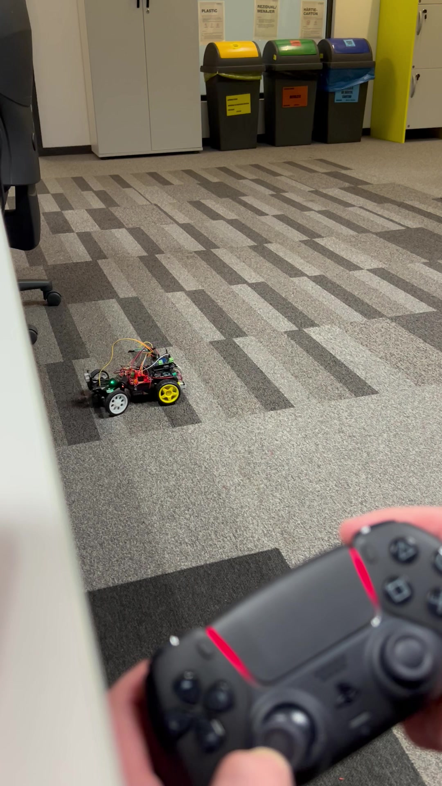
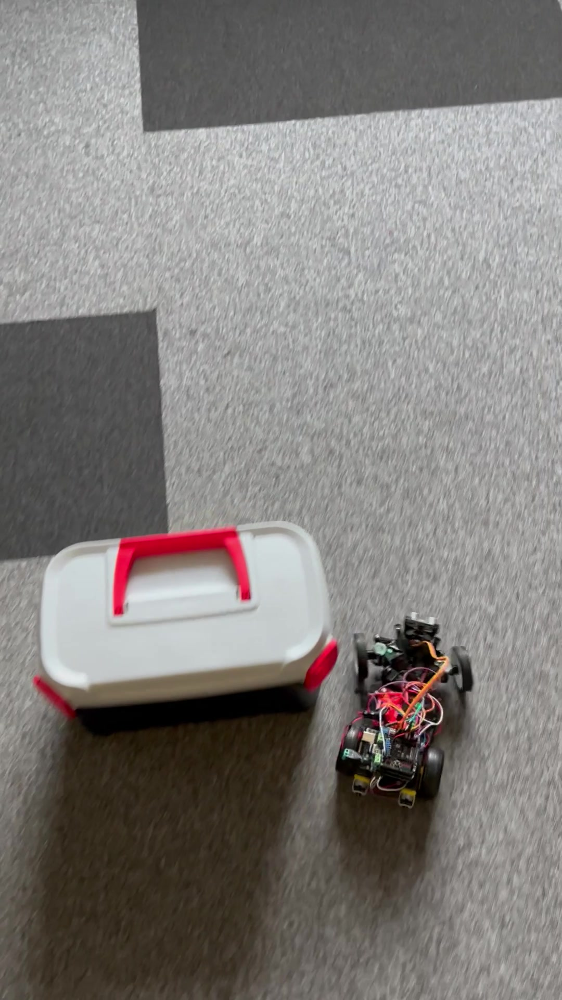
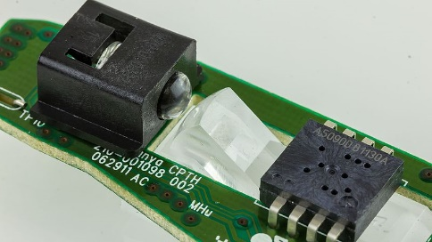
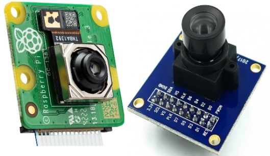
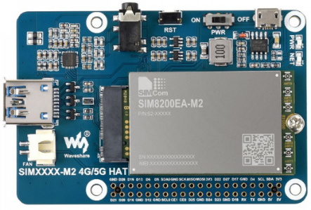
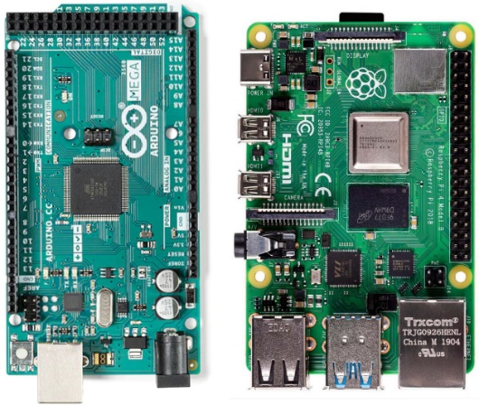

# Bluetooth Smart Car with Obstacle Avoidance Capabilities - Public Overview

Public technical overview of an Arduino-based Bluetooth smart car controlled with a PlayStation 5 controller. The project includes manual driving, analog acceleration, steering control, headlights, safety behavior, and an autonomous obstacle-avoidance mode using an ultrasonic sensor.

<p align="center">
  
</p>

<p align="center">
  <a href=https://github.com/user-attachments/assets/d0e8710e-04a5-4467-ba75-e9c4699e6d67>Manual control demo</a> ·
  <a href=https://github.com/user-attachments/assets/47ea8891-b305-4096-ac5c-5ad1a4ba3f4d>Obstacle avoidance demo</a>
</p>


> The full source code is private due to intellectual property considerations. This repository documents the project’s functionality, architecture, technologies, hardware setup, demo media, and implementation approach without exposing private source code, generated files, or internal Git history.

---

## Project Summary

This project presents a Bluetooth-controlled smart car built around an Arduino Uno and the ATmega328P microcontroller. The car can be manually controlled with a PlayStation 5 controller and can also switch into an autonomous obstacle-avoidance mode.

The system combines embedded C++ programming, wireless controller communication, motor control, steering control, ultrasonic distance sensing, LED control, and a 3D-printed chassis into a compact smart-car prototype.

---

## Demo Videos

### Manual Bluetooth Control Demo

The manual demo shows the car being controlled through the PlayStation 5 controller. The controller is used for forward movement, reverse movement, steering, headlights, and mode switching.

<p align="center">
  <a href="assets/bt-smart-car-manual-control-demo.mov">
    
  </a>
</p>

<p align="center">
  <strong>Video:</strong> <a href="assets/bt-smart-car-manual-control-demo.mov">bt-smart-car-manual-control-demo.mov</a>
</p>

### Obstacle Avoidance Demo

The obstacle-avoidance demo shows the autonomous mode, where the car uses the HC-SR04 ultrasonic sensor to detect obstacles and reposition itself without direct steering commands.

<p align="center">
  <a href="assets/bt-smart-car-obstacle-avoidance-demo.mov">
    
  </a>
</p>

<p align="center">
  <strong>Video:</strong> <a href="assets/bt-smart-car-obstacle-avoidance-demo.mov">bt-smart-car-obstacle-avoidance-demo.mov</a>
</p>

---

## Core Functionality

### Manual Bluetooth Control

The car is controlled through a PlayStation 5 controller connected over Bluetooth. The controller communicates with the Arduino system through a USB Bluetooth receiver and a USB Host Shield.

The manual driving mode supports:

- forward movement;
- reverse movement;
- analog acceleration through trigger pressure;
- left/right steering through the left stick;
- headlights on/off;
- automatic mode activation;
- automatic mode deactivation;
- controller connect/disconnect behavior.

### Obstacle Avoidance Mode

The autonomous mode uses an HC-SR04 ultrasonic sensor to detect obstacles in front of the car. When the mode is active, the car moves forward, checks for obstacles, and decides how to reposition itself when an object is detected.

<p align="center">
  
</p>

The decision flow is based on these behaviors:

1. Move forward.
2. Measure the distance to the object ahead.
3. If an obstacle is detected, slowly reposition toward one side.
4. Check the new direction.
5. If another obstacle is detected, reposition in the opposite direction.
6. If both directions are blocked, turn around.

<p align="center">
  
</p>

### Headlights

Two LEDs simulate car headlights. They are controlled directly from the PS5 controller, giving the user a more realistic driving experience.

### Safety Behavior

The implementation includes several safety-oriented behaviors:

- the car remains stationary when no movement command is received;
- the steering servo returns to a straight position when no steering command is active;
- controller disconnection can stop the car;
- an emergency-stop style behavior halts control commands.

---

## Technologies Used

### Programming & Embedded Control

- C++
- Arduino IDE
- Arduino Uno
- ATmega328P microcontroller
- PWM motor and servo control
- Timer-based control logic
- USB Host Shield communication
- Bluetooth HID controller input

### Hardware Components

- Arduino Uno development board
- PlayStation 5 controller
- USB Host Shield
- USB Bluetooth receiver
- Gravity IO Expansion Shield
- L298N dual H-bridge motor driver
- 2x DC motors, 3-6V
- MG90S servo motor
- HC-SR04 ultrasonic sensor
- 2x LEDs for headlights
- 3x switches
- 3x battery holders
- 3D-printed chassis
- screws, nuts, bolts, bearings, and 3D-printed spacers

---

## Component Gallery

### Arduino Uno

The Arduino Uno, based on the ATmega328P microcontroller, acts as the central control unit for the project.

<p align="center">
  
</p>

### Motor Driver and DC Motors

The L298N dual H-bridge motor driver controls the direction and speed of the two DC motors. PWM is used to provide smoother speed control.

<p align="center">
  
  
</p>

### Steering Servo

The MG90S servo motor controls the steering mechanism. It is driven through PWM and returns to a neutral position when no steering command is active.

<p align="center">
  
</p>

### Controller and Bluetooth Interface

The PlayStation 5 controller provides an intuitive input interface. The USB Host Shield and USB Bluetooth receiver make it possible to connect the controller to the Arduino system.

<p align="center">
  
</p>

<p align="center">
  
  
</p>

### Expansion Shield

The Gravity IO Expansion Shield expands the available I/O options and makes prototyping easier.

<p align="center">
  
</p>

### Ultrasonic Sensor

The HC-SR04 ultrasonic sensor measures the distance to objects in front of the car and provides the main input for obstacle avoidance.

<p align="center">
  
</p>

---

## 3D-Printed Chassis and Assembly

The chassis was 3D-printed and designed to hold the Arduino board, shields, motor driver, battery holders, steering system, ultrasonic sensor, and other components. The layout was chosen to make wiring and component replacement easier.

<p align="center">
  
</p>

Additional printed parts were used for the steering system and structural mounting points.

<p align="center">
  
  
</p>

The Arduino Uno is mounted on the chassis, with the USB Host Shield and Gravity IO Expansion Shield stacked above it. The front section contains the steering system and ultrasonic sensor.

<p align="center">
  
  
</p>

---

## Controller Mapping

The PlayStation 5 controller is mapped to the car’s main functions:

| Controller input | Function |
|---|---|
| PS Button | Connect / disconnect controller |
| Right Trigger | Move forward |
| Left Trigger | Move backward |
| Left Stick X-axis | Steering left / right |
| UP Button | Headlights ON / OFF |
| Triangle Button | Auto mode ON |
| Circle Button | Auto mode OFF |

This mapping creates a natural driving experience, with analog trigger acceleration and stick-based steering similar to a real vehicle interface.

---

## Software Architecture

The code was designed with a modular structure. Each major hardware area has dedicated logic, making the system easier to understand, test, and extend.

### Main Software Modules

```text
Controller input handling
  ↓
Bluetooth communication through USB Host Shield
  ↓
Manual driving command interpretation
  ↓
Motor control through L298N
  ↓
Servo steering control
  ↓
Headlight control
  ↓
Obstacle avoidance mode when enabled
```

### Motor Control

The L298N motor driver receives direction and speed commands from the Arduino. PWM is used to control motor speed, allowing smoother movement than simple on/off control.

### Servo Control

The MG90S steering servo is controlled through PWM. The steering logic includes a neutral reset behavior that brings the wheels back to a straight position when no steering input is received.

### Ultrasonic Distance Measurement

The ultrasonic sensor measures distance using trigger and echo pins. The distance is calculated from the time of the returned pulse:

```text
Distance = (Time of Impulse × 0.034) / 2
```

The factor `0.034` approximates the speed of sound in centimeters per microsecond, and the division by two accounts for the signal traveling to the object and back.

### Bluetooth Communication

The USB Bluetooth receiver is paired with the PS5 controller through the USB Host Shield. Once connected, the Arduino reads controller inputs continuously and converts them into movement, steering, light, or mode commands.

---

## Results

The implementation successfully integrated the main hardware and software components into a functional smart-car prototype.

Key results:

- The car responded correctly to PlayStation 5 controller commands.
- Analog acceleration improved the realism of the driving experience.
- Steering behavior worked through the MG90S servo motor.
- The headlights could be toggled from the controller.
- The car could switch into autonomous obstacle-avoidance mode.
- The ultrasonic sensor was used to detect nearby obstacles.
- Safety behavior prevented unintended movement when no command was active.
- Compatibility issues with USB receivers were handled through testing and component selection.
- Servo accuracy improved after using a dedicated power supply.
- DC motor performance improved after recognizing the need for separate motor power.

---

## Challenges Solved

| Challenge | Solution |
|---|---|
| USB receiver compatibility issues | Tested multiple receivers and selected one compatible with the PS5 controller |
| USB Host Shield manufacturing issue | Identified a 5V issue and re-soldered the board to restore USB power |
| Servo accuracy and reset problems | Added a dedicated power supply for the servo motor |
| DC motors initially underpowered | Moved toward a dedicated motor power supply |
| Obstacle avoidance limitations | Implemented and iterated on a rule-based detection and repositioning flow |
| Future outdoor control range | Planned 5G-based control expansion for wider operating range |

---

## Future Improvements

The project can be extended in several directions.

### Optical Sensor for 2D Localization

An optical mouse-style sensor could be used to track the car’s position indoors.

<p align="center">
  
</p>

### Stoplights and Turning Signals

Additional LEDs could be added for brake lights and turn signals, improving the realism of the prototype.

### Point-of-View Camera Streaming

A camera could be added to stream the car’s point of view, allowing remote driving even when the car is outside the user’s direct line of sight.

<p align="center">
  
</p>

### Return-to-Home Mode

A future mode could let the user set a home position and command the car to return there using the obstacle avoidance system.

### Rotating Ultrasonic Sensor

Mounting the ultrasonic sensor on an additional servo motor would allow the car to scan the environment without rotating the entire vehicle.

### 5G Control Expansion

A future version could expand the control range through a 5G module, while keeping Bluetooth control for indoor usage.

<p align="center">
  
</p>

### Alternative Control Boards

The project could move to an Arduino Mega for more ports or to a Raspberry Pi for more advanced networking and media capabilities.

<p align="center">
  
</p>

---

## Learning Outcomes

This project demonstrates practical experience with:

- embedded C++ programming;
- microcontroller-based robotics;
- Bluetooth controller integration;
- USB Host Shield communication;
- PWM-based DC motor control;
- PWM-based servo control;
- ultrasonic sensing;
- autonomous rule-based navigation;
- 3D-printed mechanical design;
- debugging hardware compatibility issues;
- integrating software, electronics, and mechanical components into one working prototype.

---

## Source Code Availability

The full source code is private due to intellectual property considerations.

A technical walkthrough, selected implementation details, or a sanitized explanation of the architecture can be provided upon request.
